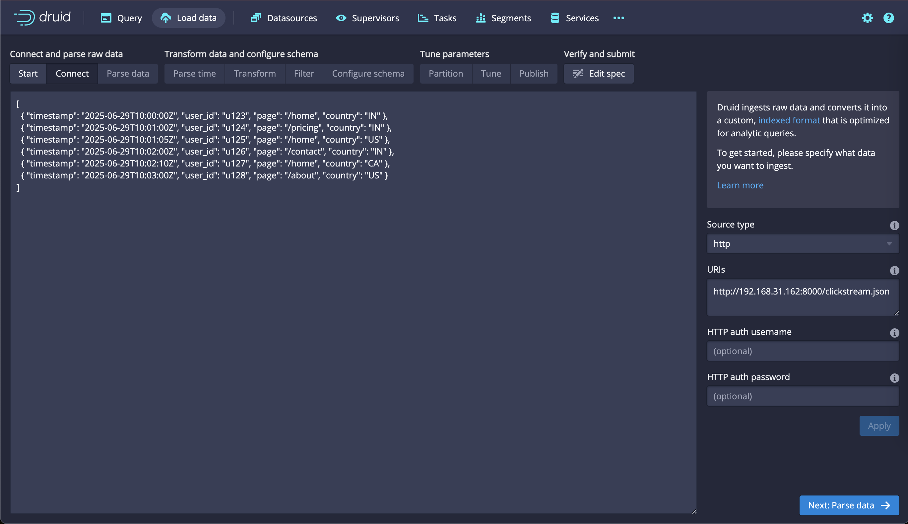

# Apache Superset Visualization with Druid

This document provides a step-by-step guide to ingest sample clickstream data into Apache Druid and visualize it with Apache Superset.

## ✅ Step 1: Setup Druid

For the Druid to run on local/production

```bash
# To start all the supported dockers
docker-compose up -d

# To stop all the supported dockers
docker-compose down -v
```

## ✅ Step 2: Sample Data — Clickstream

This project includes a `clickstream.json` file with sample data.

## ✅ Step 3: Serve Data via HTTP

To ingest the data, Druid needs to access it over HTTP. We'll start a simple web server for this purpose.

1.  Open a new terminal window in this project directory.
2.  Run the following command to start a simple Python web server:
    ```bash
    python3 -m http.server 8000
    ```
3.  Find your local IP address.\
    On macOS, you can run `ipconfig getifaddr en0` or `ifconfig | grep 'inet '` in the terminal.\
    On other systems, you might use `hostname -I` or `ip addr`.
4.  The `clickstream.json` file will now be available at `http://<YOUR_LOCAL_IP>:8000/clickstream.json`. Keep this server running during the ingestion process.

## ✅ Step 4: Ingest Data into Druid

1.  Open the Druid UI at http://localhost:8888.
2.  Go to **Load Data** → **HTTP(s)**.
3.  Enter the URL to your data file (e.g., `http://<YOUR_LOCAL_IP>:8000/clickstream.json`). Remember to replace `<YOUR_LOCAL_IP>` with your actual IP address.

    

4.  Proceed with parsing:
    - **File type**: `JSON`
    - **Parse time column**: `timestamp`
    - **Dimensions**: `user_id`, `page`, `country`
    - **Metrics**: leave empty or add a `count` metric.
    - **Timestamp format**: should auto-detect `ISO`.
    - **Datasource name**: `clickstream`
5.  Finish and submit. Wait for the ingestion task to complete.

## ✅ Step 5: Setup Superset (if not already)

If you haven't set up Superset yet, follow these steps:

```bash
# Clone Superset Repo
git clone https://github.com/apache/superset.git
```

```bash
# Jump into it
cd superset
```

```bash
# Checkout to stable tag
git checkout tags/5.0.0
```

```bash
# Run docker compose to run it
docker compose -f docker-compose-image-tag.yml up
```

In case any docker is not running, you can manually run it

Then visit: http://localhost:8088
Login with `admin` / `admin` and change the password when prompted.

## ✅ Step 6: Connect Superset to Druid

1.  In Superset, go to **Data** → **Databases** → **+ Database**.
2.  Select **Apache Druid**.
3.  Enter the connection string:
    ```
    druid://<YOUR_LOCAL_IP>:8081/druid/v2/sql/
    ```
4.  Test the connection and save.

## ✅ Step 7: Visualize the Data

1.  Go to **Data** → **Datasets** → **+ Dataset**.
2.  Select the `clickstream` datasource.
3.  Go to **Charts** → **+ Chart**.
4.  Choose your `clickstream` dataset and a chart type.

### Example Ideas:

- **Bar Chart**: Page views per page
- **Time-series Line Chart**: Count over timestamp
- **Pie Chart**: Sessions by country
- **Sunburst**: `country` → `page`

You can combine multiple charts into a dashboard with filters.
